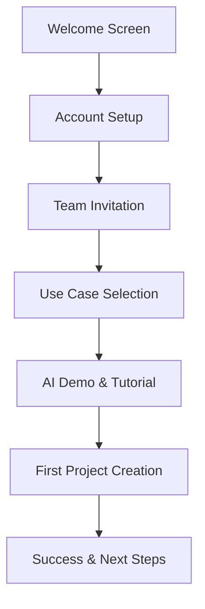
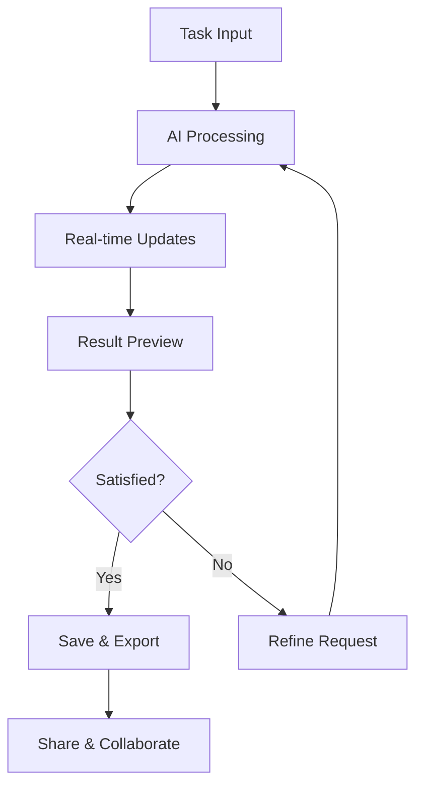
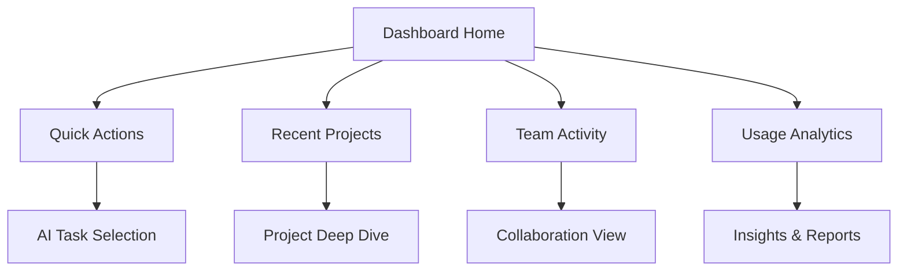

# UI/UX Strategy - SaaS AI Product Launch

## Executive Summary

Comprehensive UI/UX strategy for enterprise SaaS AI platform featuring AI-first design principles, conversational interfaces, intuitive user experience flows, and accessibility-compliant design system supporting seamless AI interaction for enterprise users.

## AI-First Design System

### Design Philosophy

**Core Principles:**
1. **Conversational by Nature** - AI interactions feel natural and human-like
2. **Intelligent Assistance** - UI adapts and learns from user behavior
3. **Transparent AI** - Clear indication of AI involvement and capabilities
4. **Trust Through Clarity** - Explainable AI outputs and decision rationale
5. **Efficient Workflows** - Streamlined paths for complex enterprise tasks

### Visual Design Language

**Color Palette:**
- **Primary Blues:** #1E40AF (trust), #3B82F6 (action), #93C5FD (accent)
- **AI Accent:** #8B5CF6 (AI elements), #A78BFA (AI highlights)
- **Semantic Colors:** #10B981 (success), #F59E0B (warning), #EF4444 (error)
- **Neutral Grays:** #111827 (text), #6B7280 (secondary), #F9FAFB (background)

**Typography System:**
```css
/* Primary Font Stack */
font-family: 'Inter', -apple-system, BlinkMacSystemFont, 'Segoe UI', system-ui;

/* Heading Hierarchy */
h1: 32px/40px, weight: 700, tracking: -0.02em
h2: 28px/36px, weight: 600, tracking: -0.01em  
h3: 24px/32px, weight: 600, tracking: normal
h4: 20px/28px, weight: 500, tracking: normal
body: 16px/24px, weight: 400, tracking: normal
caption: 14px/20px, weight: 400, tracking: 0.01em
```

**Iconography:**
- **Phosphor Icons** - Consistent line weight and style
- **AI-Specific Icons** - Custom designed for AI concepts
- **Status Indicators** - Clear visual feedback for system states
- **Contextual Actions** - Intuitive action representations

### Component Library

**Core Components:**

1. **AI Chat Interface**
```typescript
interface AIChatProps {
  messages: ChatMessage[];
  onSendMessage: (message: string) => void;
  isProcessing: boolean;
  suggestions?: string[];
  context?: ConversationContext;
}
```

2. **Smart Input Field**
```typescript
interface SmartInputProps {
  placeholder: string;
  aiSuggestions: boolean;
  autocomplete: boolean;
  validationRules: ValidationRule[];
  onAIAssist?: () => void;
}
```

3. **Result Cards**
```typescript
interface ResultCardProps {
  title: string;
  content: string;
  confidence: number;
  actions: Action[];
  exportOptions: ExportOption[];
}
```

4. **Progress Indicators**
```typescript
interface AIProgressProps {
  status: 'thinking' | 'generating' | 'complete';
  progress?: number;
  estimatedTime?: string;
  currentTask?: string;
}
```

## User Experience Flows

### Primary User Journeys

**1. New User Onboarding Flow**



**Onboarding UX Details:**
- **Step 1:** Personalized welcome based on signup source
- **Step 2:** Streamlined account setup (3 fields maximum)
- **Step 3:** Team setup with role-based permissions
- **Step 4:** Industry-specific use case selection
- **Step 5:** Interactive AI demo tailored to use case
- **Step 6:** Guided creation of first project
- **Step 7:** Success celebration with clear next actions

**2. AI Content Generation Flow**



**Content Generation UX:**
- **Input Stage:** Multi-modal input (text, files, voice)
- **Processing:** Real-time progress with transparency
- **Preview:** Interactive result exploration
- **Refinement:** Natural language iteration
- **Output:** Multiple format options
- **Collaboration:** Seamless team sharing

**3. Enterprise Dashboard Flow**



### Micro-Interactions Design

**AI Response Animations:**
- Typing indicators with realistic timing
- Progressive content revelation
- Smooth state transitions
- Contextual loading states

**Feedback Mechanisms:**
- Instant visual confirmation
- Hover states with AI predictions
- Drag-and-drop with smart suggestions
- Gesture-based shortcuts for power users

## Conversational Interface Design

### Chat Interface Architecture

**Message Types:**
```typescript
interface MessageTypes {
  user: {
    text: string;
    attachments?: File[];
    timestamp: Date;
  };
  
  assistant: {
    text: string;
    elements?: UIElement[];
    confidence: number;
    sources?: Source[];
    actions?: Action[];
  };
  
  system: {
    type: 'info' | 'warning' | 'error';
    message: string;
    dismissible: boolean;
  };
}
```

**Conversation Context Management:**
- Session persistence across page refreshes
- Context-aware follow-up suggestions
- Thread branching for exploring alternatives
- Smart conversation summarization

### Voice Interface Integration

**Voice Commands:**
- "Generate a marketing email about..."
- "Analyze this document for..."
- "Create a presentation on..."
- "Summarize our meeting notes"

**Voice Feedback:**
- Audio confirmation of commands
- Progress updates during processing
- Results summary narration
- Error explanation and guidance

### Multimodal Input Handling

**Input Methods:**
- **Text:** Natural language queries and commands
- **Voice:** Speech-to-text with noise cancellation
- **Files:** Drag-and-drop with preview
- **Images:** OCR and visual analysis
- **Screen Sharing:** Real-time collaboration

## Responsive Design Strategy

### Breakpoint System

```css
/* Mobile First Approach */
@media (min-width: 640px)  { /* sm */ }
@media (min-width: 768px)  { /* md */ }
@media (min-width: 1024px) { /* lg */ }
@media (min-width: 1280px) { /* xl */ }
@media (min-width: 1536px) { /* 2xl */ }
```

### Mobile Experience Optimization

**Mobile-First AI Interactions:**
- Swipe gestures for result navigation
- Voice-first input on mobile devices
- Simplified UI with essential actions
- Offline capability for basic functions

**Tablet Experience:**
- Split-screen collaboration
- Touch-optimized AI controls
- Adaptive layout for portrait/landscape
- Apple Pencil support for annotations

### Desktop Power User Features

**Advanced Interactions:**
- Keyboard shortcuts for AI commands
- Multiple AI conversations in tabs
- Drag-and-drop between projects
- Advanced filtering and search

## Accessibility and Inclusive Design

### WCAG 2.1 AA Compliance

**Visual Accessibility:**
- Minimum 4.5:1 color contrast ratios
- Scalable fonts up to 200% zoom
- High contrast mode support
- Reduced motion preferences

**Keyboard Navigation:**
- Full keyboard accessibility
- Logical tab order throughout interface
- Skip links for main content areas
- Focus indicators for all interactive elements

**Screen Reader Optimization:**
- Semantic HTML structure
- ARIA labels for complex interactions
- Live regions for AI updates
- Descriptive alt text for visual content

### AI Accessibility Features

**AI-Powered Accessibility:**
- Auto-generated alt text for images
- Text summarization for long content
- Voice narration of AI responses
- Automatic content translation

**Inclusive AI Interactions:**
- Simple language mode option
- Visual explanation of complex concepts
- Multiple interaction modalities
- Cultural sensitivity in AI responses

## User Testing Strategy

### Testing Methodology

**User Research Phases:**

1. **Discovery Research (Pre-Launch)**
   - User interviews with target personas
   - Competitive analysis and benchmarking
   - Card sorting for information architecture
   - Journey mapping workshops

2. **Usability Testing (Development)**
   - Moderated usability sessions
   - A/B testing for key interactions
   - Prototype testing with stakeholders
   - Accessibility testing with diverse users

3. **Validation Testing (Pre-Release)**
   - Beta user feedback collection
   - Performance testing under load
   - Edge case scenario testing
   - Cross-browser and device testing

### Testing Participants

**Target User Personas:**

**1. Enterprise Manager (Sarah, 35)**
- Manages team of 15+ knowledge workers
- Values efficiency and ROI measurement
- Needs clear oversight and control features
- Primary use case: Team productivity enhancement

**2. Content Creator (Marcus, 28)**
- Creates marketing and sales materials
- Needs creative inspiration and iteration
- Values quality and brand consistency
- Primary use case: Content generation and optimization

**3. Data Analyst (Priya, 31)**
- Analyzes business data and trends
- Needs accurate insights and explanations
- Values transparency and data integrity
- Primary use case: Data analysis and reporting

**4. IT Administrator (David, 42)**
- Manages enterprise software rollouts
- Values security and compliance features
- Needs administrative controls and monitoring
- Primary use case: Platform management and governance

### Usability Metrics

**Quantitative Metrics:**
- **Task Success Rate:** >90% for primary flows
- **Time on Task:** <2 minutes for common actions
- **Error Recovery:** <30 seconds to resolve errors
- **User Satisfaction:** NPS >50, CSAT >4.5/5

**Qualitative Insights:**
- User confidence in AI recommendations
- Perceived value of AI assistance
- Trust in AI-generated content
- Ease of learning and adoption

## Prototyping and Validation

### Prototyping Tools and Process

**Design Tools:**
- **Figma** - Primary design and prototyping platform
- **Principle** - Complex interaction prototypes
- **Lottie** - Micro-animation design
- **Maze** - Unmoderated usability testing

**Prototyping Fidelity:**
```typescript
interface PrototypeFidelity {
  wireframes: {
    purpose: 'Structure and flow validation';
    tools: ['Whimsical', 'Figma'];
    testing: 'Internal stakeholder review';
  };
  
  lowFidelity: {
    purpose: 'Basic interaction testing';
    tools: ['Figma', 'InVision'];
    testing: 'Concept validation with users';
  };
  
  highFidelity: {
    purpose: 'Detailed usability testing';
    tools: ['Figma', 'Principle'];
    testing: 'Comprehensive user testing';
  };
  
  interactive: {
    purpose: 'Pre-development validation';
    tools: ['Figma', 'React'];
    testing: 'Beta user validation';
  };
}
```

### A/B Testing Strategy

**Key Testing Areas:**
1. **Onboarding Flow Variations**
   - Guided tour vs. self-discovery
   - Video tutorials vs. interactive demos
   - Progressive disclosure vs. full feature reveal

2. **AI Interaction Patterns**
   - Chat interface vs. form-based input
   - Immediate results vs. processing indicators
   - Single AI vs. multiple AI personalities

3. **Dashboard Layout Options**
   - Project-centric vs. task-centric organization
   - Sidebar navigation vs. top navigation
   - Card-based vs. list-based content display

### Validation Criteria

**Success Metrics:**
- **Usability:** Task completion >90%, user satisfaction >4.5/5
- **Adoption:** Feature usage >60% within 30 days
- **Performance:** Page load <2s, interaction response <200ms
- **Accessibility:** WCAG 2.1 AA compliance, screen reader compatibility

## Implementation Guidelines

### Development Handoff Process

**Design Specifications:**
```typescript
interface DesignSpec {
  component: {
    name: string;
    description: string;
    props: ComponentProps;
    states: ComponentState[];
    interactions: Interaction[];
  };
  
  visual: {
    spacing: SpacingTokens;
    colors: ColorTokens;
    typography: TypographyTokens;
    elevation: ShadowTokens;
  };
  
  behavior: {
    animations: Animation[];
    transitions: Transition[];
    accessibility: A11yRequirements;
  };
}
```

**Quality Assurance:**
- Design review checkpoints at 25%, 50%, 75%, and 100%
- Cross-browser testing on Chrome, Firefox, Safari, Edge
- Device testing on iOS, Android, Windows, macOS
- Performance auditing with Lighthouse scores >90

### Design System Maintenance

**Living Design System:**
- Monthly component library updates
- Usage analytics for component adoption
- Regular accessibility audits and updates
- Feedback collection from development teams

**Documentation Standards:**
- Component usage guidelines and examples
- Accessibility implementation notes
- Performance optimization recommendations
- Interaction behavior specifications

## Launch and Post-Launch Optimization

### Phased Rollout Strategy

**Phase 1: Limited Beta (100 users)**
- Core functionality testing
- Initial user feedback collection
- Performance monitoring under real usage
- Critical bug identification and resolution

**Phase 2: Expanded Beta (1,000 users)**
- Scalability testing and optimization
- Feature usage pattern analysis
- A/B testing of alternative designs
- Customer success team feedback integration

**Phase 3: Full Launch (All users)**
- Complete feature set availability
- Marketing campaign integration
- Customer support team training
- Continuous improvement process initiation

### Continuous Improvement Process

**User Feedback Integration:**
- In-app feedback collection mechanisms
- Regular user survey deployment (monthly)
- User interview program (weekly sessions)
- Feature request prioritization framework

**Data-Driven Optimization:**
- User behavior analytics with Mixpanel
- Heatmap analysis with Hotjar
- Conversion funnel optimization
- Performance monitoring and alerting

**Iterative Design Process:**
- Bi-weekly design sprint cycles
- Regular usability testing sessions
- Quarterly design system reviews
- Annual user research and strategy updates

## Success Metrics and KPIs

### User Experience Metrics

**Engagement Metrics:**
- **Daily Active Users (DAU):** Target >70% of registered users
- **Session Duration:** Target >20 minutes average
- **Feature Adoption:** Target >60% adoption within 30 days
- **Return Usage:** Target >80% 7-day return rate

**Satisfaction Metrics:**
- **Net Promoter Score (NPS):** Target >50
- **Customer Satisfaction (CSAT):** Target >4.5/5
- **Task Success Rate:** Target >90%
- **Support Ticket Volume:** Target <5% of users

**AI Interaction Metrics:**
- **AI Task Completion:** Target >85% successful completions
- **Refinement Iterations:** Target <2 iterations per task
- **AI Confidence Acceptance:** Target >70% high-confidence acceptance
- **Voice Command Usage:** Target >30% of eligible interactions

## Conclusion

This comprehensive UI/UX strategy provides a robust foundation for delivering an exceptional enterprise AI experience. The AI-first design system, conversational interfaces, and user-centered design approach ensure that complex AI capabilities remain accessible and intuitive for enterprise users.

Key UX advantages:
- Intuitive conversational AI interactions
- Responsive design across all devices
- WCAG 2.1 AA accessibility compliance
- Data-driven continuous improvement
- Enterprise-grade usability and adoption metrics

The implementation guidelines and testing strategy provide clear direction for development teams while maintaining design quality and user experience standards throughout the product lifecycle.

**Design Readiness:** UI/UX specifications approved for development with comprehensive testing and validation protocols in place.